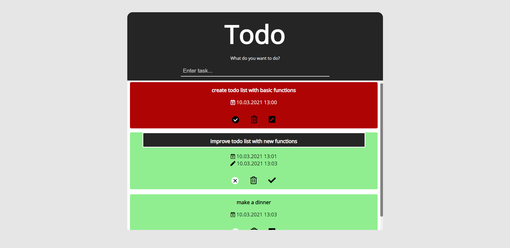

# CRUD TODO LIST
### Get the code
```
git clone https://github.com/rnycz/crud-todo.git
```
CRUD operations made in JavaScript, layout made in HTML and SCSS.<br />
Data (tasks) are saved in the browser using _localStorage_.
### How it works?
Enter the task and submit it pressing enter then task will be displayed in list below.<br />
You can mark the entered task as complete or simply delete and update it. You can also check when a task has been added or edited.<br />

